# Airbnb homepage

The purpose of this document is to give you a step by step approach to solve the following exercise from Le Wagon: 

**04-Front-End/02-CSS-components/04-Airbnb-homepage**


In this exercise, will focus on the cards first. 


Our starting point

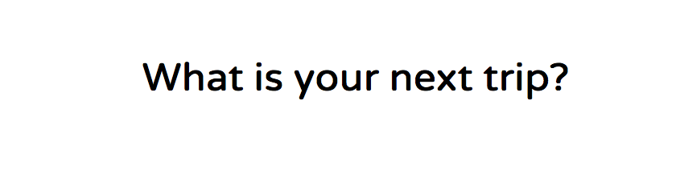

## **Draw all your ****div**** first 🎨🎨🎨**

Drawing the structure of a component is the hardest part, but once you've done that, it becomes so much easier to nail the CSS! We've helped you a little here and given you the structure of the cards you need to reproduce in this challenge:

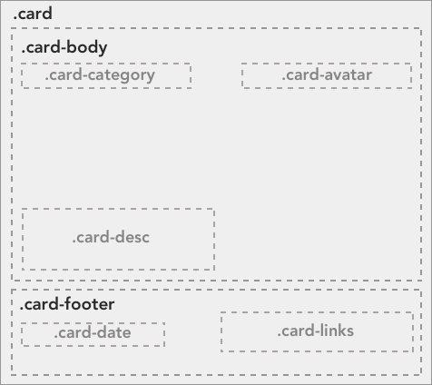

## Step 1 - Seeing our boxes

We start by inserting the follow lines in our header: (We will remove them later)

```html
<style>
  * {
    border: 1px solid black;
  }
</style>
```

```html
<html>
  <head>
    <meta charset="utf-8">
    <title>Airbnb home</title>
    <link href="https://fonts.googleapis.com/css?family=Varela+Round" rel="stylesheet">
    <link href="http://maxcdn.bootstrapcdn.com/font-awesome/4.2.0/css/font-awesome.min.css" rel="stylesheet">
    <link rel="stylesheet" href="css/style.css">
    <style>
      * {
        border: 1px solid black;
      }
    </style>
  </head>
```

You can press control + option + S to open Safari on the Mac and control + option + C to open Chrome. V should open Firefox. 

Now we have borders everywhere and we can see our boxes and divs. 

Let's start by adding the first layer. The three cards. 

Type the following line followed by a press on the Tab key. 

```html
.card*3
```

It should unfold to this

```html
<div class="card"></div>
<div class="card"></div>
<div class="card"></div>
```

Put the names of the cities as content so we can easily identify our boxes. 

```html
<div class="card">Shanghai</div>
<div class="card">Rio</div>
<div class="card">Berlin</div>
```

Then we are going to give some size to our boxes to we can see them. 

In the folder css/components/ find the card.css file and added following style:

```css
.card {
  height: 200px;
  width: 300px;
}
```

You should now see this: 

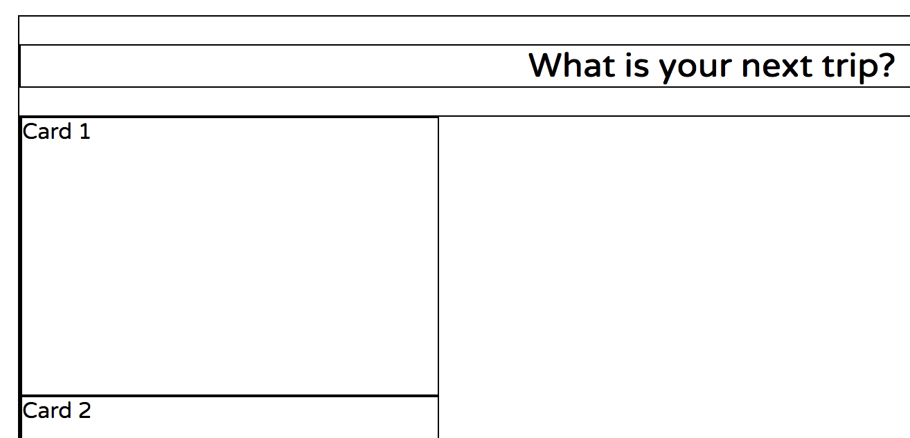

To put the boxes next to each other we will use a flexbox.

```css
.cards {
  display: flex;
}

.card {
  height: 200px;
  width: 300px;
}
```

This aligns our three boxes inside the cards div. 

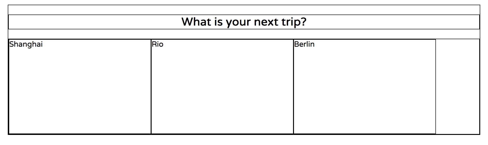

To get the cards evenly distributed we add the following line to our cards css selector:

  justify-content: space-between;

```css
.cards {
  display: flex;
  justify-content: space-between;
}

.card {
  height: 200px;
  width: 300px;
}
```

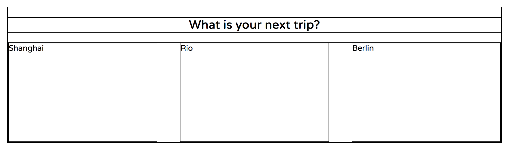

Now it definitely looks better and we can move on to focus on what has to go inside our cards. 

A quick reminder of what we are aiming at: 


Type the following line followed by a press on the Tab key. 

```html
  .card-body+.card-footer
```
It should unfold to this
```html
  <div class="card-body"></div>
  <div class="card-footer"></div>
```
Move the title into the card-body and add some text in the card-footer. 
```html
<div class="card">
  <div class="card-body">Shanghai</div>
  <div class="card-footer">Posted on 22/11/17</div>
</div>
```

And give the card-body a height so we can get an idea about what it will look like. 

```css
.card-body {
  height: 150px;
}
```
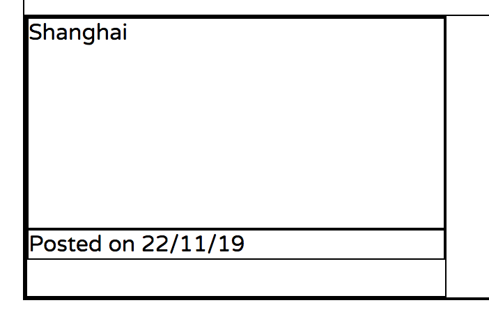


Prepare some space inside the card-body div and type the following line followed by Tab. 

```html
.card-category+.card-avatar+.card-description
```
It should unfold to this
```html
<div class="card-category"></div>
<div class="card-avatar"></div>
<div class="card-description"></div>
```
Fill in the following information in the first card. 
```html
<div class="card">
  <div class="card-body" id="background1">
    <div class="card-category">Shanghai</div>
    <div class="card-avatar">Avatar</div>
    <div class="card-description">
      <h2>Jad's home</h2>
      <p>Charming room in Shanghai</p>
    </div>
  </div>
  <div class="card-footer">Posted on 22/11/19</div>
</div>
```
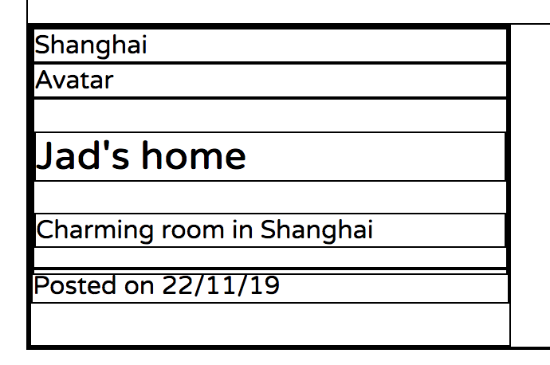

By using **position relative** and **absolute** we can place the category, the avatar and the description within the card-body. 

```css
.card-body {
  height: 150px;
  position: relative;
}

.card-category {
  position: absolute;
  top: 10px;
  left: 10px;
}

.card-avatar {
  position: absolute;
  top: 10px;
  right: 10px;
}

.card-description {
  position: absolute;
  bottom: 10px;
  left: 10px;
}
```
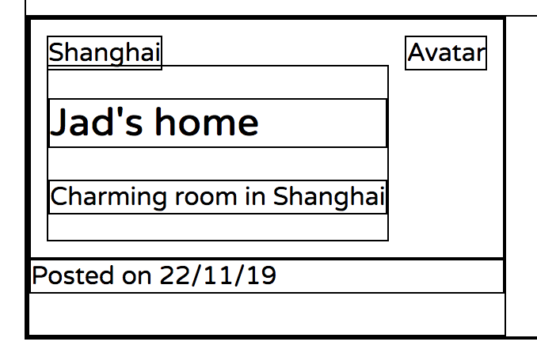

It looks good, but our h2 has a bit too much margin. We will remove it by setting the margin-bottom to zero. 

```css
.card-description > h2 {
  margin-bottom: 0;
}
```

Now, let's look at the footer. 

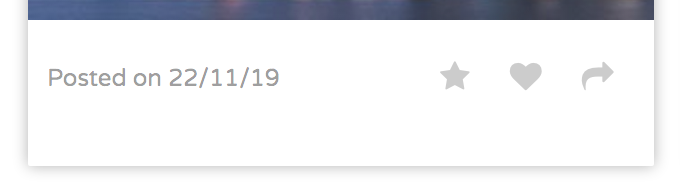

The footer has a text to the left and a grouping of symbols to the right. We will use a flexbox to lay it out.

The text "Posted on 22/11/19" is a simple paragraph, but we have to introduce a div to group the three symbols together and we will give it a class name "controls" because we will also use a flexbox to lay them out.

Start by creating some empty lines in the card-footer div and type the following line followed by Tab.. 

```html
p+.controls>a*3
````

It should unfold to this
```html
<p></p>
<div class="controls">
  <a href=""></a>
  <a href=""></a>
  <a href=""></a>
</div>
```
Move the text "Posted on 22/11/19" in between the p tags and use the following code to get the symbols from font-awesome. 
```html
<i class="fa fa-star"></i>
<i class="fa fa-heart"></i>
<i class="fa fa-share"></i> 
```
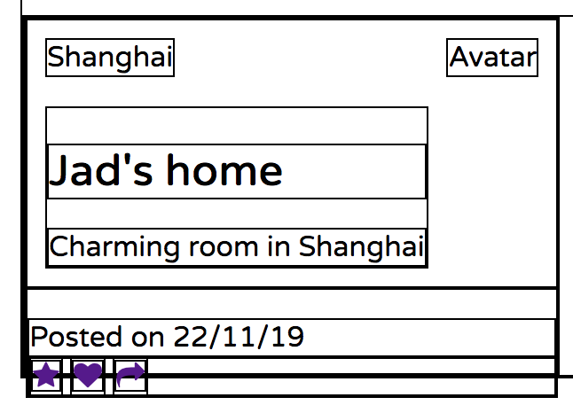

Then create the corresponding css selectors and add the flexbox properties.
```css
.card-footer {
  display: flex;
  justify-content: space-between;
  align-items: center;
}

.controls {
  display: flex;
  justify-content: space-around;
}
```
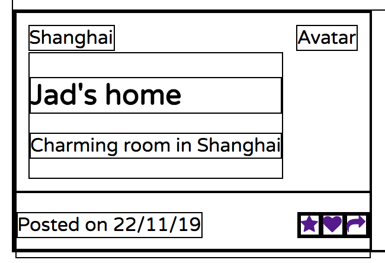

In the beginning we added a height to the card to get an idea of what we were going to have. Now that we have content in the card, we can remove it and instead put a height in the card-body.

```css
.card {
  width: 300px;
  margin: 10px;
}

.card-body {
  height: 180px;
  position: relative;
}
```
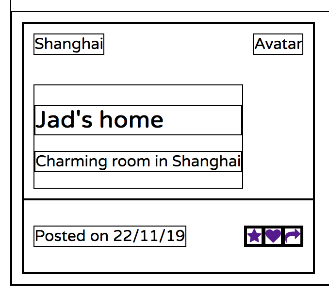

I also added some padding to the card-footer to avoid having the text and the icons too close to the border of the card.

```css
.card-footer {
  display: flex;
  justify-content: space-between;
  align-items: center;
  padding: 10px;
}

.controls {
  display: flex;
  justify-content: space-around;
}
```

Now that we have our elements positioned, it is time to put a border on our card and remove the other black lines. 

Add the following lines to the .card class selector in the css file.

```css
.card {
  width: 300px;
  margin: 10px;
  border-radius: 1px;
  box-shadow: 0 0 10px rgba(0,0,0,0.3);
}
```

and remove the style we inserted in our html file in the beginning. 

```css
<style>
  * {
    border: 1px solid black;
  }
</style>
```


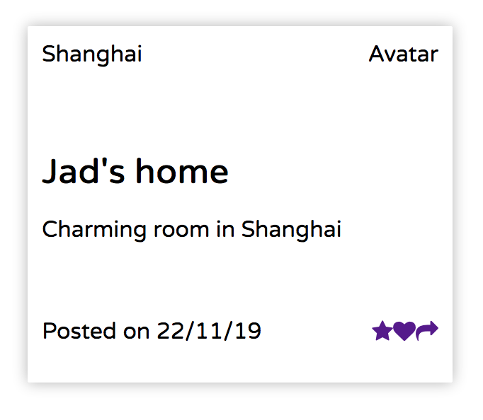
```css
.card-footer .controls i {
  padding: 0 10px;
  text-decoration: none;
  color: black;
}

.card-footer p {
  font-size: 12px;
  color: gray;
}
```
With the above we create some space around the symbols and change the color. 

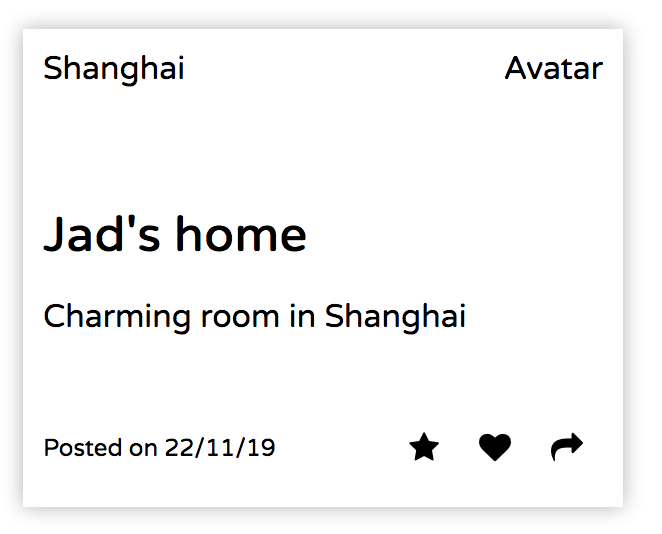


To add a the background image directly we will add an id to the card and a corresponding id selector in the css file.

```css
#background1 {
  background-image: linear-gradient(rgba(0,0,0,0.6), rgba(0,0,0,0.2)), url('../../images/shanghai.jpg');
}
```

```html
<div class="card">
  <div class="card-body" id="background1">
    <div class="card-category">Shanghai</div>
    <div class="card-avatar">
      
    </div>
    <div class="card-description">
      <h2>Jad's home</h2>
      <p>Charming room in Shanghai</p>
    </div>
  </div>
```
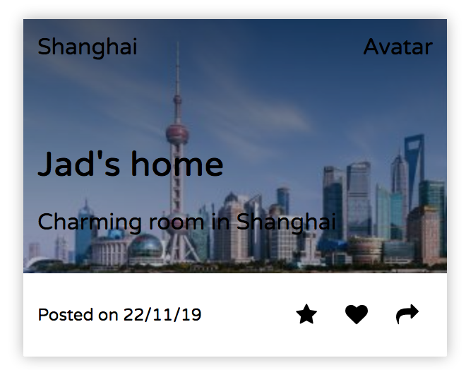

Change the font color to white.
```css
.card-body {
  height: 180px;
  position: relative;
  color: white;
}
```


Set the color in the footer to gray.
```css
.card-footer .controls i {
  padding: 0 10px;
  text-decoration: none;
  color: gray;
}

.card-footer p {
  font-size: 12px;
  color: gray;
}
```


Now that we have the first card in place, we are ready to put content into the next two. 

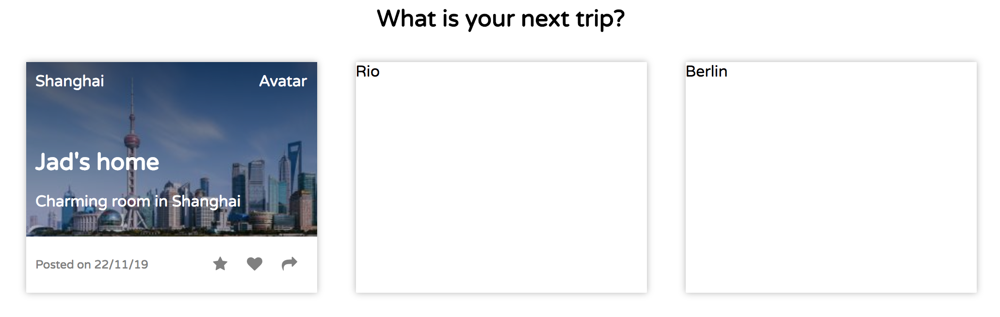

I also uppercased the text in the categories to match our target. 


We can now replace the "Avatar" placeholder with a nice picture. 

Replace the following line: 
```html
<div class="card-avatar">Avatar</div>
```
With: 
```html
<div class="card-avatar">
  
</div>
```
And add the following lines to your avatar. css file. 

```css
.avatar {
    width: 40px;
    border-radius: 50%;
}
```


 

Well done!

